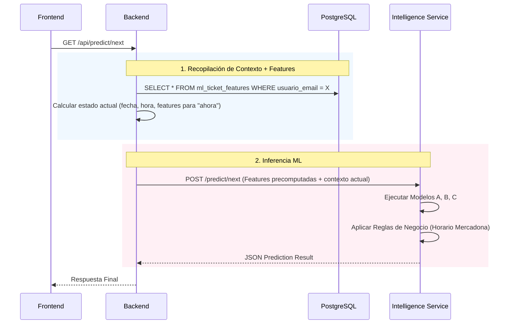

🔮 Plan de Implementación: Sistema de Predicción "Next Shop" (ML-Powered)

Estado: Planificación Técnica  
Tecnología: Rust (Orquestador) + Python (Motor ML Scikit-Learn) + PostgreSQL (Feature Store ligero)  
Objetivo: Predecir con precisión **cuándo** irá el usuario a comprar, **cuánto** gastará y **qué productos** específicos necesitará, adaptándose al contexto temporal y reutilizando al máximo la potencia de PostgreSQL para precalcular características.

---

## 1. Visión General del Sistema

El sistema responde a la pregunta del usuario:

> **"¿Cuándo me toca ir a Mercadona y qué necesito?"**

A diferencia de un sistema puramente estadístico, utilizaremos **Machine Learning Supervisado** para aprender patrones complejos (ej: “El usuario gasta más los viernes a principio de mes” o “Compra cerveza solo si es fin de semana por la tarde”). :contentReference[oaicite:0]{index=0}  

La novedad en esta iteración del diseño es que:

> **PostgreSQL actuará como un “mini feature store”**, precalculando la mayoría de las *features* que alimentan los modelos, sin cambiar la lógica de los modelos en Python.

---

## 1.1. La "Predicción Desacoplada"

Implementaremos **tres modelos independientes** que trabajan en conjunto:

- **Cronos (Tiempo)**: Predice el momento (Día + Franja Horaria).
- **Tesoro (Dinero)**: Predice el importe total (independiente de los productos).
- **Cesta (Productos)**: Predice la probabilidad de cada producto individualmente. :contentReference[oaicite:1]{index=1}  

A nivel de arquitectura:

- **PostgreSQL** precalcula las características (features) mediante vistas dedicadas.
- **Python (FastAPI)** toma esas features ya precocinadas y ejecuta los modelos (RandomForest, KNN, etc.).
- **Rust (Axum)** orquesta las llamadas, expone la API pública y se integra con el resto de Mercastats.

---

## 2. Arquitectura de Datos y Modelos (Python Microservice)

El servicio de Inteligencia (`intelligence-service`) expondrá endpoints para **entrenar** y **predecir**, pero en lugar de hacer toda la ingeniería de características dentro de Python, se apoyará en vistas SQL específicas en PostgreSQL. :contentReference[oaicite:2]{index=2}  

La base de datos ya incluye las tablas principales:

- `compras` (tickets de compra, fecha_hora, total, usuario)  
- `compras_productos` (líneas de producto por ticket)  
- `productos`, `historico_precios`, `usuarios`, etc. :contentReference[oaicite:3]{index=3}  

Sobre esta base, definimos **nuevas vistas orientadas a ML**.

---

## 2.1. Ingeniería de Características (Feature Engineering)

### 2.1.1. Features clásicas usadas por los modelos

Transformaremos los datos crudos de SQL en vectores numéricos para el ML. Estas siguen siendo las mismas *features* conceptuales ya definidas: :contentReference[oaicite:4]{index=4}  

| Feature (Entrada)                | Descripción                                  | Tratamiento              |
|---------------------------------|----------------------------------------------|--------------------------|
| `day_of_week`                   | 0 (Lunes) - 6 (Domingo)                      | One-Hot / numérico       |
| `day_of_month`                  | 1 - 31                                       | Cíclico (sen/cos) o num. |
| `hour_of_day`                   | 0 - 23                                       | Cíclico (sen/cos)        |
| `days_since_last_shop`         | Días desde la última visita                  | Numérico (escalado)      |
| `rolling_avg_spend`            | Gasto medio últimas N visitas (ej. 5)        | Numérico                 |
| `is_payday_week`               | ¿Primera semana del mes?                     | Booleano                 |
| `total_last_7d` / `last_30d`   | Gasto en los últimos X días                  | Numérico                 |
| `tickets_last_30d`             | Nº de tickets últimos 30 días                | Numérico                 |

La **diferencia clave** de esta versión del plan es:

> Muchas de estas columnas se calculan directamente en PostgreSQL mediante **vistas** (y opcionalmente vistas materializadas), en lugar de construirlas en Python con pandas.

---

## 2.2. Vistas de Feature Engineering en PostgreSQL

A partir del esquema actual de Mercastats, definiremos al menos **dos vistas principales** para ML: :contentReference[oaicite:5]{index=5}  

1. `ml_ticket_features`  
2. `ml_product_stats` (y opcionalmente una vista derivada `ml_user_product_stats`)

Estas vistas **no cambian la lógica de los modelos**, solo delegan el cálculo de features a Postgres.

---

### 2.2.1. Vista `ml_ticket_features`

Objetivo: para cada ticket en `compras`, exponer en una sola fila todas las features necesarias para los modelos **Cronos** y **Tesoro** (Modelos A y B).  

**Inputs base**:  

- Tabla `compras` (fecha_hora, total, usuario_email, tienda, etc.).  
- Se calculan:

  - Día de la semana, del mes, hora.
  - Días desde la compra anterior del mismo usuario.
  - Gasto medio últimas N compras.
  - Gasto últimos 7/30 días.
  - Flags como `is_payday_week`.

Ejemplo de definición simplificada (puedes ajustarla a tus necesidades):

```sql
CREATE OR REPLACE VIEW ml_ticket_features AS
WITH compras_ordenadas AS (
    SELECT
        c.numero_factura,
        c.usuario_email,
        c.fecha_hora,
        c.total,
        LAG(c.fecha_hora) OVER (
            PARTITION BY c.usuario_email
            ORDER BY c.fecha_hora
        ) AS prev_fecha_hora
    FROM compras c
),
compras_con_delta AS (
    SELECT
        numero_factura,
        usuario_email,
        fecha_hora,
        total,
        EXTRACT(EPOCH FROM (fecha_hora - prev_fecha_hora)) / 86400.0
            AS days_since_last_shop
    FROM compras_ordenadas
),
compras_con_acumulados AS (
    SELECT
        c.numero_factura,
        c.usuario_email,
        c.fecha_hora,
        c.total,
        c.days_since_last_shop,
        -- gasto últimos 30 días
        (
            SELECT COALESCE(SUM(c2.total), 0.0)
            FROM compras c2
            WHERE c2.usuario_email = c.usuario_email
              AND c2.fecha_hora BETWEEN c.fecha_hora - INTERVAL '30 days' AND c.fecha_hora
        ) AS total_last_30d,
        -- nº tickets últimos 30 días
        (
            SELECT COUNT(*)
            FROM compras c3
            WHERE c3.usuario_email = c.usuario_email
              AND c3.fecha_hora BETWEEN c.fecha_hora - INTERVAL '30 days' AND c.fecha_hora
        ) AS tickets_last_30d
    FROM compras_con_delta c
)
SELECT
    numero_factura,
    usuario_email,
    fecha_hora,
    total,
    -- Features temporales
    EXTRACT(DOW FROM fecha_hora)      AS day_of_week,
    EXTRACT(DAY FROM fecha_hora)      AS day_of_month,
    EXTRACT(HOUR FROM fecha_hora)     AS hour_of_day,
    COALESCE(days_since_last_shop, 0) AS days_since_last_shop,
    total_last_30d,
    tickets_last_30d,
    -- Ejemplo de "is_payday_week": primera semana del mes
    (EXTRACT(DAY FROM fecha_hora) BETWEEN 1 AND 7) AS is_payday_week
FROM compras_con_acumulados;
````

> 📝 **Nota**: Si quieres optimizar, esta vista se puede convertir en **vista materializada** y refrescarse de forma periódica.

---

### 2.2.2. Vista `ml_product_stats`

Objetivo: alimentar el modelo **Cesta (Productos)** con estadísticas de probabilidad/frecuencia por producto y contexto temporal, usando la tabla `compras_productos` y `compras`. 

Por ejemplo, podemos crear una vista global de frecuencia:

```sql
CREATE OR REPLACE VIEW ml_product_stats AS
SELECT
    cp.producto_nombre,
    COUNT(*)                     AS times_bought,
    SUM(cp.cantidad)            AS total_quantity,
    SUM(cp.precio_total)        AS total_spent,
    AVG(cp.precio_unitario)     AS avg_unit_price
FROM compras_productos cp
GROUP BY cp.producto_nombre;
```

Y una vista por usuario y día de semana (para contexto):

```sql
CREATE OR REPLACE VIEW ml_user_product_stats AS
SELECT
    c.usuario_email,
    cp.producto_nombre,
    EXTRACT(DOW FROM c.fecha_hora) AS day_of_week,
    COUNT(*)                       AS times_bought,
    SUM(cp.cantidad)               AS total_quantity,
    SUM(cp.precio_total)           AS total_spent
FROM compras_productos cp
JOIN compras c
  ON cp.compra_numero_factura = c.numero_factura
GROUP BY c.usuario_email, cp.producto_nombre, EXTRACT(DOW FROM c.fecha_hora);
```

Con estas vistas, el microservicio Python puede:

* Leer estadísticas de frecuencia por usuario/producto y por día de la semana.
* Combinarlas con los modelos de clasificación (o incluso reemplazar el RandomForest por lógica probabilística basada en estas distribuciones cuando haya muy pocos datos).

---

### 2.2.3. Uso desde el Microservicio de ML

En lugar de que Python tenga que:

1. Leer toda la tabla `compras` raw.
2. Calcular `days_since_last_shop`, totales últimos 30 días, etc., en pandas.

Ahora puede hacer:

* Para entrenamiento:

  * `SELECT * FROM ml_ticket_features WHERE usuario_email = $1 ORDER BY fecha_hora;`
* Para inferencia:

  * Calcular las features para “ahora” bien en Rust o con una pequeña query ad-hoc basada en la misma lógica de la vista.
* Para sugerir productos:

  * `SELECT * FROM ml_user_product_stats WHERE usuario_email = $1 ORDER BY times_bought DESC LIMIT 50;`

Esto te da:

* Menos lógica duplicada entre Rust y Python.
* Aprovechar el coste en rendimiento que ya te da PostgreSQL.

---

## 2.3. Definición de Modelos (sin cambios de lógica)

La lógica de los modelos **sigue siendo la misma** definida originalmente, solo cambia **de dónde salen las features**.

---

### 🤖 Modelo A: NextVisitRegressor (El "Cuándo")

* **Algoritmo**: `RandomForestRegressor` o `GradientBoostingRegressor`. 
* **Target**: `days_until_next_shop` (float).
* **Input**: features de `ml_ticket_features` (`day_of_week`, `hour_of_day`, `days_since_last_shop`, `is_payday_week`, `total_last_30d`, etc.).
* **Lógica**:

  * Entrenamiento: se construye el target como la diferencia en días entre una compra y la siguiente, por usuario.
  * Predicción: el modelo devuelve cuántos días faltan desde “ahora”; se suma a la fecha actual para obtener la fecha objetivo.

#### Sub-modelo Horario: KNeighborsClassifier

* **Algoritmo**: `KNeighborsClassifier`.
* **Target**: franja horaria / hora concreta.
* **Input**: contexto temporal de `ml_ticket_features` + salida del modelo de días (día de semana objetivo).
* **Lógica**:

  * Se busca, entre compras históricas similares (mismo día de semana, patrón de recencia), la hora más probable.
  * Esto es especialmente natural en KNN, dado el small data.

---

### 🤖 Modelo B: TicketValueRegressor (El "Cuánto")

* **Algoritmo**: `RandomForestRegressor`. 
* **Target**: `total_amount` (campo `total` de `compras`).
* **Inputs**:

  * Features temporales de `ml_ticket_features`.
  * La `next_shop_date` predicha por el Modelo A (para saber si es principio/fin de mes, etc.).
* **Lógica**:

  * Entrenamiento: se entrena sobre tickets históricos con sus features ya precalculadas.
  * Predicción: dado el contexto actual + fecha objetivo predicha, se estima el importe de la compra.

*(Opcionalmente, en implementaciones futuras se puede sustituir o complementar este modelo con un Gaussian Process Regression aprovechando el small data, pero eso no cambia el plan de features.)*

---

### 🤖 Modelo C: BasketClassifier (El "Qué")

* **Algoritmo**: `RandomForestClassifier` (uno por producto frecuente o multi-label), tal y como se definió originalmente. 
* **Estrategia**:

  * Para cada producto “Top N” del usuario, entrenar un clasificador binario (1/0) que indica si ese producto estará o no en la próxima compra dado el contexto.
* **Features específicas**:

  * Además de `ml_ticket_features`, se pueden usar campos derivados de `ml_user_product_stats`:

    * `days_since_last_purchase_of_item` (calculable en SQL de forma similar a `days_since_last_shop` pero a nivel de producto).
    * `item_frequency` (de `ml_user_product_stats`).
* **Salida**:

  * Probabilidad (0.0 a 1.0) por producto.
  * Se muestran los productos que superen un umbral (p.ej. > 0.7).

> 🔁 Importante: aunque en la práctica el small data hace que un modelo probabilístico simpler (frecuencias + recencia) sea muy competitivo, **este plan mantiene la lógica original con RandomForest**, delegando a Postgres el cálculo de stats base para mejorar estabilidad.

---

## 3. Flujo de Ejecución (Runtime)



> 🐍 Nota: el calentamiento del worker de Python y su inicialización ya están cubiertos por el mecanismo de warm-up documentado previamente. 

---

## 4. Reglas de Negocio (Post-Procesado)

El microservicio Python aplicará una capa de "sanitización lógica" sobre la predicción cruda del ML antes de responder: 

### 4.1. Horario Mercadona

* Si la hora predicha está fuera de `09:00 - 21:30`, ajustar al límite más cercano.
* Si es domingo, mover la compra al lunes siguiente.

### 4.2. Coherencia de Productos

* Si la probabilidad de un producto es alta (>80%) pero se compró ayer (y no es pan/frescos), penalizar la probabilidad (evitar falsos positivos por sobreajuste).
* Se pueden usar campos de `ml_user_product_stats` para determinar recencia y frecuencia.

---

## 5. Contrato de API (Interface)

### 5.1. Petición (Rust -> Python)

// `POST /predict/next`

```json
{
  "user_id": "uuid...",
  "current_date": "2025-10-27T10:00:00",
  "features_now": {
    "day_of_week": 1,
    "day_of_month": 27,
    "hour_of_day": 10,
    "days_since_last_shop": 4.5,
    "total_last_30d": 123.45,
    "tickets_last_30d": 6,
    "is_payday_week": false
  },
  "history_features": [
    {
      "numero_factura": "XXXX-XXX-XXXXXX",
      "fecha_hora": "2025-10-20T18:30:00",
      "total": 45.50,
      "day_of_week": 1,
      "day_of_month": 20,
      "hour_of_day": 18,
      "days_since_last_shop": 3.0,
      "total_last_30d": 200.00,
      "tickets_last_30d": 5,
      "is_payday_week": true
    }
    // ... últimos 30–50 tickets
  ]
}
```

*(El formato exacto puede variar, pero la idea es que Rust ya envía features, no datos crudos de DB.)*

### 5.2. Respuesta (Python -> Rust)

```json
{
  "prediction": {
    "timestamp": "2025-10-30T18:00:00",
    "time_window_label": "Jueves por la tarde (18:00 - 19:00)",
    "estimated_total": 52.40,
    "confidence": 0.85,
    "suggested_products": [
      {
        "name": "LECHE HACENDADO",
        "probability": 0.92,
        "price_estimation": 5.70,
        "reason": "Alta probabilidad por ciclo de consumo"
      },
      {
        "name": "PIZZA FRESCA",
        "probability": 0.78,
        "price_estimation": 2.99,
        "reason": "Habitual los jueves noche"
      }
    ]
  }
}
```

---

## 6. Plan de Trabajo (Roadmap)

### Fase 1: Infraestructura de ML (Python)

* [ ] Instalar scikit-learn, pandas, joblib.
* [ ] Crear estructura de clases: `ShoppingPredictor`.
* [ ] Implementar pipeline de entrenamiento (`train()`) que guarda el modelo en memoria o disco.
* [ ] Implementar endpoint `/predict/next`.
* [ ] Adaptar el código para consumir **features provenientes de PostgreSQL** (no solo datos crudos).

### Fase 2: Feature Store ligero en PostgreSQL

* [ ] Crear vista `ml_ticket_features`.
* [ ] Crear vista `ml_user_product_stats` (y `ml_product_stats` global).
* [ ] (Opcional) Convertir las vistas a **materialized views** y establecer un job de refresco.
* [ ] Ajustar índices si es necesario para rendimiento.

### Fase 3: Conexión Backend (Rust)

* [ ] Crear servicio `services/intelligence.rs`.
* [ ] Implementar queries SQL eficientes contra `ml_ticket_features` y vistas relacionadas.
* [ ] Cliente HTTP para llamar al microservicio Python con features ya precalculadas.

### Fase 4: Frontend (Leptos)

* [ ] Diseñar componente `PredictionCard`.
* [ ] Mostrar "Loading Skeleton" mientras la IA piensa (1–2s).
* [ ] Visualizar probabilidad (barras de progreso / chips de productos).

### Fase 5: Entrenamiento Continuo

* [ ] Modificar endpoint de subida de ticket.
* [ ] Al confirmar un ticket nuevo:

  * Actualizar tablas base (`compras`, `compras_productos`).
  * Refrescar vistas materializadas si se usan.
  * Lanzar evento o llamada al Python ML Service para reentrenar rápido el modelo de ese usuario (retraining pequeño o incremental).

---

## 7. Consideraciones de Escalabilidad

* **Entrenamiento**:

  * Un RandomForest con <1000 filas se entrena en milisegundos; sigue siendo viable entrenar on-demand por usuario. 
* **Concurrencia**:

  * Gunicorn + múltiples workers para FastAPI.
  * PostgreSQL maneja fácilmente vistas y agregados en este volumen de datos.
* **PostgreSQL como Feature Store**:

  * Las vistas concentran la lógica de feature engineering en un único sitio.
  * La inferencia sigue en Python; la DB solo preprocesa.

---
Nueva Vista: Prediction

Ruta: /prediction

Icono Sidebar: ✨ (Sparkles/Stars) - Estilo "Gemini".

4.2. Componente AIGeneratingLoader

Un componente visual que imita la generación de texto de un LLM.

Visual: Bloques de texto grises que pulsan (efecto shimmer) con un gradiente que se mueve de izquierda a derecha.

Comportamiento:

Al entrar, aparece inmediatamente.

Se mantiene visible mínimo 1.5s (aunque el backend responda antes) para dar "peso" a la predicción.

Desaparece con un fade-out suave revelando el contenido real.

4.3. Diseño de la Tarjeta de Predicción

En lugar de datos tabulares, usaremos una Tarjeta de Lenguaje Natural:

"Hola Juan, según tus hábitos,

Tu próxima visita será probablemente este Lunes por la tarde, entre las 18:00 y las 20:00.

Estimamos un ticket entre 45€ y 55€.

No olvides revisar si te falta:

🥛 Leche (Muy probable)

🥚 Huevos (Probable)"

5. Plan de Trabajo (Roadmap)

Fase 1: Infraestructura de ML (Python)

[ ] Instalar scikit-learn, pandas, joblib.

[ ] Crear clase ShoppingPredictor con lógica de rangos (± std dev).

[ ] Implementar endpoint /predict/next que devuelva rangos (min, max, estimated).

Fase 2: Conexión Backend (Rust)

[ ] Crear servicio services/intelligence.rs.

[ ] Implementar lógica de conteo de tickets para enviar el flag learning_mode si hay < 15 tickets.

Fase 3: Frontend "AI Experience" (Leptos)

[ ] Icono: Añadir icono "Sparkles" al Sidebar.

[ ] Componente: Crear SkeletonText con animación CSS animate-pulse y gradiente.

[ ] Vista: Implementar pages/prediction.rs.

[ ] Lógica: Si learning_mode es true, mostrar el mensaje de "Aprendiendo patrones" tras la animación.

6. Detalles de Implementación Visual (CSS/Tailwind)

Para lograr el efecto de "texto vibrando/generándose":

/* En tailwind.config.js o estilo inline */
@keyframes shimmer {
  0% { background-position: -1000px 0; }
  100% { background-position: 1000px 0; }
}

.animate-shimmer {
  animation: shimmer 2s infinite linear;
  background: linear-gradient(to right, #f6f7f8 4%, #edeef1 25%, #f6f7f8 36%);
  background-size: 1000px 100%;
}


El componente AIGeneratingLoader usará bloques div con esta clase y anchos aleatorios (w-3/4, w-full, w-5/6) para simular párrafos de texto.


