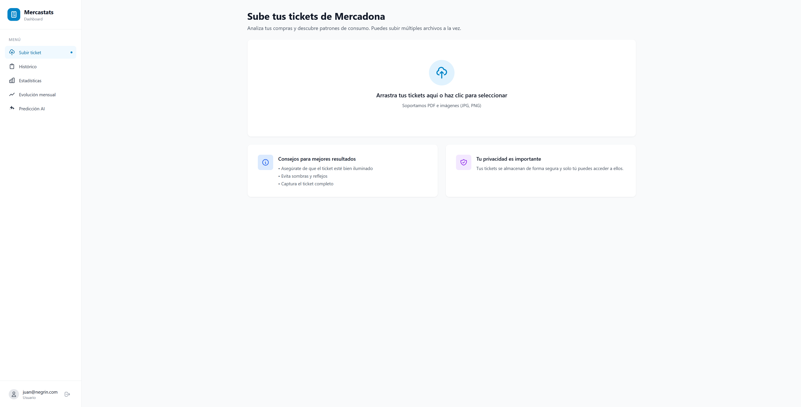
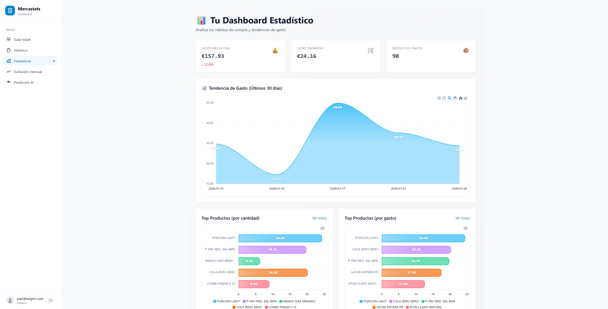
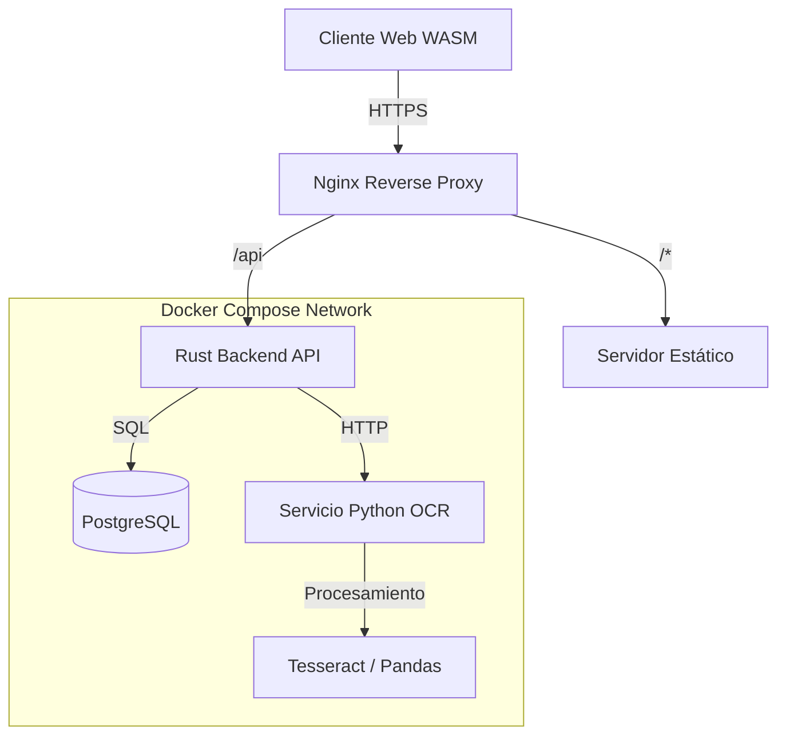

# 🛒 Mercastats

[](https://www.rust-lang.org/)
[](https://www.python.org/)
[-red?style=flat&logo=webassembly>)](https://leptos.dev/)
[](https://www.docker.com/)
[](https://www.postgresql.org/)

> **Plataforma de análisis de gastos y hábitos de consumo basada en tickets digitales.**
> Un ejercicio de ingeniería de sistemas enfocado en arquitectura de microservicios, orquestación y flujos de datos modernos.

---

## 🚀 Demo en Vivo y Acceso Rápido

Puedes probar la aplicación desplegada ahora mismo. No es necesario usar tu correo real.

🔗 **URL:** [http://54.37.231.34/](http://54.37.231.34/)

| Rol              | Email           | Contraseña |
| :--------------- | :-------------- | :--------- |
| **Usuario Demo** | `demo@demo.com` | `demodemo` |

### ⚠️ Limitaciones Importantes de la Demo

Para mantener la simplicidad y privacidad en este entorno de demostración:

1.  **Solo Tickets Digitales:** El sistema procesa exclusivamente los **PDFs** que genera la app de Mercadona (Factura electrónica). **No funciona con fotos** de tickets físicos arrugados.
2.  **Supermercado:** Optimizado únicamente para el formato de **Mercadona**.
3.  **Privacidad:** Las cuentas creadas y los datos subidos se **eliminan automáticamente cada 48 horas**. Puedes usar un correo inventado al registrarte.

---

## 📸 Galería del Proyecto

|                    Dashboard Principal                     |                  Detalle de Análisis                  |
| :--------------------------------------------------------: | :---------------------------------------------------: |
|  |  |
|      _Visualización de Dashboard de carga de tickets_      |              _Vista de las estadísticas_              |

---

## 🛠️ Ingeniería, Enfoque y Uso de IA

> **Nota del Autor:** Este proyecto tiene un fuerte componente experimental y de aprendizaje.

El objetivo principal no ha sido demostrar dominio exhaustivo de la sintaxis de un lenguaje concreto, sino **explorar y comprender el diseño de sistemas backend complejos de forma integral**, desde la arquitectura y la infraestructura hasta la base de datos y los flujos de datos.

### Decisiones Técnicas

Las decisiones estructurales —arquitectura de microservicios, elección de PostgreSQL, esquema de base de datos, uso de Docker y orquestación— han sido tomadas conscientemente por mí y constituyen el núcleo del valor de este proyecto.

### Desarrollo "AI-Augmented"

Se ha utilizado IA como herramienta activa de apoyo al desarrollo, especialmente en el servicio backend con **Rust**.

- **El Experimento:** Evaluar hasta qué punto agentes de IA pueden agilizar el desarrollo en un lenguaje de bajo nivel (Rust) sin perder el control sobre la arquitectura.
- **La Realidad:** Aunque parte del código ha sido generado con asistencia, **la lógica de negocio, la comunicación entre servicios, la seguridad (JWT) y el modelado de datos han sido definidos, revisados y orquestados por mí.**

**Mercastats demuestra:**

1.  Capacidad para diseñar y entender una arquitectura backend completa.
2.  Conocimiento práctico de infraestructura, contenedores y despliegue.
3.  Criterio técnico en la elección de tecnologías y trade-offs.
4.  Uso consciente de IA como herramienta de productividad, no como sustituto del razonamiento técnico.

---

## 🏗️ Arquitectura del Sistema

El sistema no es un monolito, sino un conjunto de servicios containerizados que se comunican entre sí.



### Componentes Principales

- **Frontend (Rust + Leptos):**
  - Single Page Application (SPA) compilada a WebAssembly.
  - Gestión de estado reactiva y alto rendimiento en el cliente.

- **Backend Core (Rust):**
  - API RESTful de alto rendimiento.
  - Gestión de autenticación (JWT), subida de archivos y orquestación.
  - Manejo de errores robusto y tipado seguro.

- **Servicio de Inteligencia (Python):**
  - Microservicio especializado en procesamiento de datos.
  - Extracción de texto (OCR) y normalización de productos (Pandas).
  - **Decisión de diseño:** Usar Python donde brilla (datos) y Rust donde importa el rendimiento (servidor).

- **Base de Datos (PostgreSQL):**
  - Modelado relacional estricto con funciones PL/pgSQL para lógica de negocio compleja.

## 📁 Estructura del Proyecto

Una visión rápida de cómo está organizado el código:

```
.
├── backend/                  # API Principal (Rust)
│   ├── src/models/           # Definiciones de structs y datos
│   ├── src/routes/           # Endpoints de la API
│   └── dockerfile            # Definición del contenedor
├── frontend/                 # Cliente Web (Leptos/WASM)
│   ├── src/pages/            # Vistas (Login, Upload, Dashboard)
│   ├── src/components/       # UI Kit reutilizable
│   └── ...
├── intelligence-service/     # Microservicio de Datos (Python)
│   ├── src/processor.py      # Lógica de extracción y limpieza
│   └── ...
├── sql/                      # Esquemas y Scripts de DB
└── docker-compose.yml        # Orquestación de todo el sistema
```

## 🐳 Despliegue e Infraestructura

El proyecto utiliza **Docker** para orquestar los 4 servicios fundamentales que componen la aplicación, garantizando consistencia entre desarrollo y producción.

El sistema se levanta mediante `docker-compose`, orquestando los siguientes contenedores:

1.  **Base de Datos (`db`):** Imagen oficial de PostgreSQL 16 (Alpine). Persistencia mediante volúmenes Docker.
2.  **Servicio de Inteligencia (`intelligence-service`):** Microservicio en Python encargado del procesamiento pesado (OCR, ML). Se comunica con la base de datos y es consumido por el backend.
3.  **Backend (`backend`):** El núcleo de la aplicación en Rust. Orquesta las peticiones, gestiona la autenticación y conecta con la base de datos y el servicio de inteligencia.
4.  **Frontend (`frontend`):** Servidor web (Nginx) que sirve la aplicación WebAssembly (SPA). Actúa como punto de entrada para el usuario.

```yaml
# Fragmento simplificado del stack (docker-compose.yml)

services:
  db:
    image: postgres:16-alpine
    container_name: mercastats_db
    # ...

  intelligence-service:
    build:
      context: ./intelligence-service
      dockerfile: Dockerfile
    container_name: mercastats_intelligence
    depends_on:
      - db

  backend:
    build:
      context: .
      dockerfile: backend/dockerfile
    ports: ["8000:8000"]
    depends_on:
      - db
      - intelligence-service

  frontend:
    build:
      context: ./frontend
      dockerfile: dockerfile
    ports: ["3000:80"]
    depends_on:
      - backend
```

## Contacto

Creado por [Juan Carlos Negrín](https://github.com/Darkrai500)
